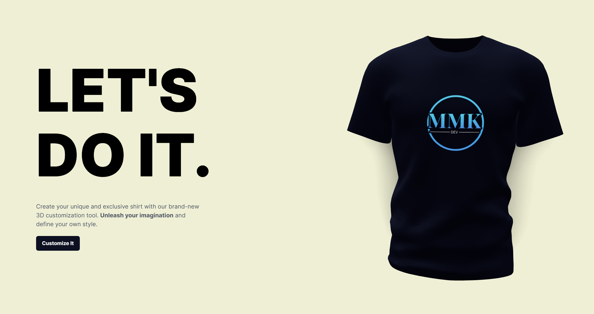

# 3D Tee Maker

**3D Tee Maker** یک اپلیکیشن وب مبتنی بر React است که به کاربران این امکان را می‌دهد تا یک تیشرت سه‌بعدی را با افزودن رنگ‌ها، تکسچرها و لوگوهای مختلف سفارشی کنند. علاوه بر این، اپلیکیشن با استفاده از هوش مصنوعی (از طریق DALL-E) به کاربران این امکان را می‌دهد که لوگوها و تکسچرهای جدید بر اساس درخواست‌هایی که می‌دهند، ایجاد کنند. این اپلیکیشن همچنین از بک‌اند برای مدیریت دارایی‌هایی مانند تصاویر و تکسچرها با استفاده از Cloudinary و MongoDB برای ذخیره‌سازی داده‌های کاربران پشتیبانی می‌کند.

## ویژگی‌ها

- **سفارشی‌سازی تیشرت سه‌بعدی تعاملی:**
  - رنگ، تکسچر و لوگوی تیشرت سه‌بعدی را به‌صورت آنی سفارشی کنید.
  - امکان آپلود تکسچرها یا لوگوهای سفارشی برای شخصی‌سازی طراحی شما.

  

- **تولید لوگو و تکسچر با استفاده از هوش مصنوعی:**
  - از هوش مصنوعی DALL-E برای تولید لوگوها و تکسچرهای منحصر به فرد برای تیشرت استفاده کنید.
  - یکپارچگی بدون درز با API OpenAI برای تولید خودکار دارایی‌ها.
  
  

- **پشتیبانی از بک‌اند:**
  - **یکپارچگی با Cloudinary:** مدیریت و ذخیره‌سازی دارایی‌های تولید شده (تصاویر، تکسچرها) در فضای ابری.
  - **ذخیره‌سازی داده‌ها با MongoDB:** ذخیره و بازیابی سفارشی‌سازی‌ها و تاریخچه کاربران.
  - **API Express با پشتیبانی از CORS و Dotenv:** بک‌اند با استفاده از Express ساخته شده، با پیکربندی CORS و استفاده از متغیرهای محیطی برای مدیریت پیکربندی.

## تکنولوژی‌ها

### فرانت‌اند:
- **React:** برای ساخت رابط کاربری پویا برای سفارشی‌سازی تیشرت.
- **@react-three/fiber:** برای رندر کردن مدل سه‌بعدی تیشرت.
- **Framer Motion:** برای افزودن انیمیشن به فرآیند سفارشی‌سازی تیشرت.
- **TailwindCSS:** برای طراحی و استایل‌دهی به اپلیکیشن با استفاده از CSS مبتنی بر ابزار.
- **Vite:** برای بسته‌بندی سریع و بهینه‌سازی شده دارایی‌های فرانت‌اند.

### بک‌اند:
- **Node.js و Express:** منطق سرور برای مدیریت درخواست‌ها، از جمله آپلود دارایی‌ها و تولید دارایی‌های هوش مصنوعی.
- **MongoDB و Mongoose:** برای ذخیره‌سازی داده‌ها و تاریخچه کاربران.
- **Cloudinary:** برای ذخیره‌سازی تصاویر و دیگر دارایی‌ها در فضای ابری.
- **OpenAI API:** برای تولید لوگوها و تکسچرها با استفاده از هوش مصنوعی DALL-E.

## نحوه استفاده

1. **سفارشی‌سازی تیشرت خود:**
   - رنگ‌ها، تکسچرها و لوگوها را برای تیشرت سه‌بعدی خود انتخاب کنید.
   - می‌توانید تکسچرها یا لوگوهای خود را نیز آپلود کنید.
   
   

2. **تولید دارایی‌های هوش مصنوعی:**
   - یک درخواست برای هوش مصنوعی (DALL-E) برای تولید لوگوها و تکسچرها وارد کنید.
   - دارایی‌های تولید شده به‌صورت آنی به تیشرت اعمال خواهند شد.

   

3. **ذخیره یا دانلود:**
   - وقتی از طراحی خود راضی بودید، می‌توانید آن را ذخیره کرده یا تصویر تیشرت را دانلود کنید.

## ویژگی‌های آینده

- **حساب‌های کاربری:** به کاربران این امکان را بدهید که طراحی‌های خود را ذخیره کرده و در دستگاه‌های مختلف به آن‌ها دسترسی داشته باشند.
- **اشتراک‌گذاری در شبکه‌های اجتماعی:** گزینه‌های اشتراک‌گذاری در شبکه‌های اجتماعی را برای کاربران فراهم کنید تا تیشرت‌های سفارشی‌شده خود را به اشتراک بگذارند.
