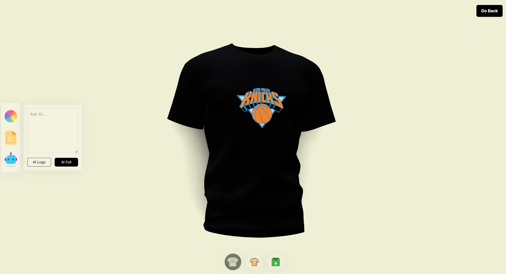

# 3D Tee Maker

**3D Tee Maker** is a React-based web application that allows users to customize a 3D t-shirt by adding colors, textures, and logos. Additionally, the app integrates with AI (via DALL-E) to generate logos and textures based on prompts provided by the user. The app also has backend functionality to manage assets like images and textures using Cloudinary and MongoDB for storing user data.

## Features

- **Interactive 3D Tee Customization:**
  - Customize the color, texture, and logo of the 3D t-shirt in real-time.
  - Upload custom textures or logos to personalize your design.

  

- **AI-Powered Logo and Texture Generation:**
  - Use DALL-E AI to generate unique logos and textures for the t-shirt.
  - Seamless integration with OpenAI’s API for automatic asset generation.

  

- **Backend Support:**
  - **Cloudinary Integration:** Manage and store generated assets (images, textures) in the cloud.
  - **MongoDB for Data Storage:** Store and retrieve user customizations and history.
  - **Express API with CORS and Dotenv:** Backend built with Express, configured for CORS, and using environment variables for configuration management.

## Tech Stack

### Frontend:
- **React:** To build the dynamic UI of the t-shirt customizer.
- **@react-three/fiber:** To render the 3D model of the t-shirt.
- **Framer Motion:** For adding animations to the t-shirt customization process.
- **TailwindCSS:** For styling the app using utility-first CSS.
- **Vite:** For fast and optimized bundling of the frontend assets.

### Backend:
- **Node.js & Express:** Server-side logic to handle requests, including asset uploads and AI-powered asset generation.
- **MongoDB & Mongoose:** To store user data and history.
- **Cloudinary:** For storing images and other assets in the cloud.
- **OpenAI API:** To generate logos and textures using DALL-E AI.

## Usage

1. **Customize Your Tee:**
   - Choose colors, textures, and logos for your 3D t-shirt.
   - You can also upload your own textures or logos.
   
   

2. **Generate AI Assets:**
   - Input a prompt for the AI (DALL-E) to generate logos and textures.
   - The generated assets will be applied to the t-shirt in real-time.

   

3. **Save or Download:**
   - Once you're happy with your design, you can save the customization or download the image of the t-shirt.

## Future Enhancements

- **User Accounts:** Allow users to save their designs and access them across different devices.
- **Social Media Sharing:** Integrate social media sharing options for users to showcase their customized tees.
